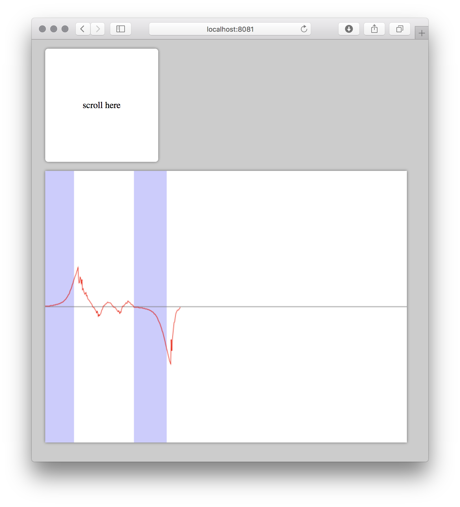

# Magic Trackpad's inertial scroll Detector
* Apple's Magic trackpad emits *pseudo inertial* scroll event. This module determines wheter a wheel event is a **real** event (generated by a user's action) or a **pseudo inertial** event.
* [Working Demo](https://michitaro.github.io/magic-trackpad-detector)



## Install

```sh
npm instasll --save @hscmap/magic-trackpad-detector
```

## Example (source code of the working demo)

```typescript
import { MagicTrackpadDetector } from "@hscmap/magic-trackpad-detector"


window.addEventListener('load', e => {
    const trackpad = document.querySelector('.trackpad') as HTMLDivElement
    const canvas = document.querySelector('canvas') as HTMLCanvasElement

    const history: [number, boolean][] = []
    const mtd = new MagicTrackpadDetector()
    const historyCanvas = new HistoryCanvas(history, canvas)

    trackpad.addEventListener('wheel', e => {
        e.preventDefault()
        history.unshift([e.deltaY, mtd.inertial(e)])
        if (history.length > canvas.width)
            history.splice(canvas.width)
        historyCanvas.refresh()
    })

    historyCanvas.refresh()
})


class HistoryCanvas {
    private ctx: CanvasRenderingContext2D
    private w: number
    private h: number

    constructor(private history: [number, boolean][], canvas: HTMLCanvasElement) {
        this.ctx = canvas.getContext('2d')!
        this.w = canvas.width
        this.h = canvas.height
    }

    refresh() {
        this.clear()
        this.drawInertialAreas()
        this.drawAxis()
        this.drawHistory()
    }

    private clear() {
        this.ctx.clearRect(0, 0, this.w, this.h)
    }

    private drawInertialAreas() {
        const ctx = this.ctx
        let state = false
        let start: number
        this.history.push([0, false])
        for (let x = 0; x < this.history.length; ++x) {
            const [, i] = this.history[x]
            if (state != i) {
                if (state = i)
                    start = x
                else {
                    ctx.fillStyle = '#ccf'
                    ctx.fillRect(start!, 0, x - start, this.h)
                }
            }
        }
        this.history.pop()
    }

    private drawHistory() {
        const ctx = this.ctx
        ctx.strokeStyle = '#f00'
        ctx.beginPath()
        for (let x = 0; x < this.history.length; ++x) {
            const [y,] = this.history[x]
            ctx.lineTo(x, y + this.h / 2)
        }
        ctx.stroke()
    }

    private drawAxis() {
        const ctx = this.ctx
        ctx.beginPath()
        ctx.strokeStyle = '#777'
        ctx.lineTo(0, this.h / 2)
        ctx.lineTo(this.w, this.h / 2)
        ctx.stroke()
    }
}
```
